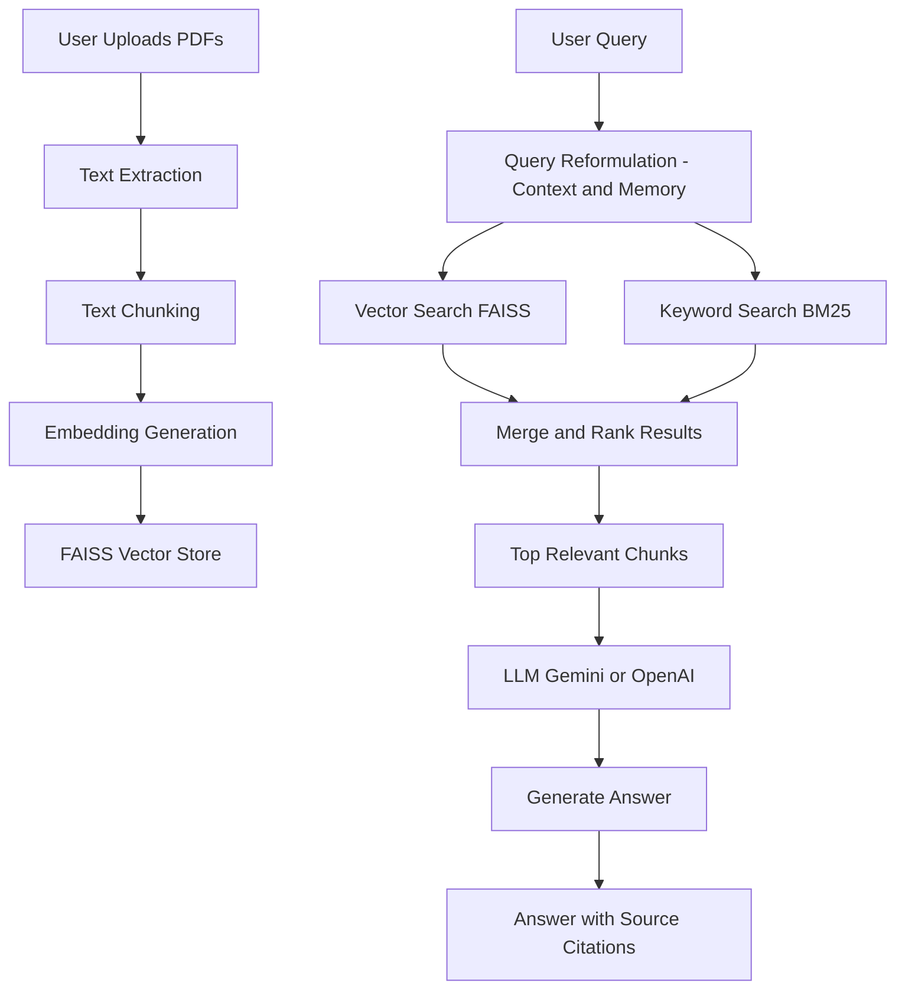

# 🤖 Multi-Document Conversational AI (RAG System)

🚀 An advanced **Retrieval-Augmented Generation (RAG)** system that enables users to interact with multiple documents through a conversational interface, delivering **accurate, context-aware, and source-grounded responses**.

---

## 💡 What This Project Does

This system allows users to:

* Upload multiple PDF documents
* Ask questions in natural language
* Receive answers strictly from document content
* View **exact sources (document + page)**

👉 Focus: **accuracy, explainability, and usability**

---

## 🔥 Key Features

| Feature                   | Description                                 |
| ------------------------- | ------------------------------------------- |
| 📂 Multi-Document Support | Upload and query multiple PDFs              |
| 🧠 Context-Aware Chat     | Handles follow-up questions using memory    |
| 🔍 Hybrid Retrieval       | Combines semantic (vector) + keyword search |
| 📌 Source Citations       | Displays document name + page number        |
| 🚫 Hallucination Control  | Avoids generating answers outside documents |

---

## 🏗️ System Workflow



---

## ⚙️ How It Works

| Step | Process                                  |
| ---- | ---------------------------------------- |
| 1    | Extract text from uploaded PDFs          |
| 2    | Split text into smaller chunks           |
| 3    | Convert chunks into embeddings           |
| 4    | Store embeddings in FAISS                |
| 5    | Reformulate query using chat history     |
| 6    | Retrieve relevant chunks (hybrid search) |
| 7    | Generate grounded response using LLM     |

---

## 🛠️ Tech Stack

| Category  | Technology             |
| --------- | ---------------------- |
| Language  | Python 3.10+           |
| Framework | LangChain              |
| Vector DB | FAISS                  |
| UI        | Streamlit              |
| LLM       | Google Gemini / OpenAI |

---

## 💼 Use Cases

* 📚 Study assistant for students
* 📄 Research document analysis
* 🏢 Internal company knowledge chatbot
* ⚖️ Legal/technical document querying

---

## ⚙️ Setup Instructions

```bash
git clone https://github.com/Kshama-1104/RAG-Powered-Multi-Document-Conversational-AI.git
cd RAG-Powered-Multi-Document-Conversational-AI

python -m venv venv
venv\Scripts\activate      # Windows
source venv/bin/activate   # Mac/Linux

pip install -r requirements.txt
streamlit run app.py
```

---

## 📈 Future Improvements

| Feature     | Description                           |
| ----------- | ------------------------------------- |
| Voice Input | Speech-to-text interaction            |
| Performance | Faster retrieval with caching         |
| UI Upgrade  | Improved chat interface               |
| Analytics   | Query tracking and evaluation metrics |

---

## 👩‍💻 Author

**Kshama Mishra**
B.Tech (CS-AI)

---

## 📜 License

MIT License
